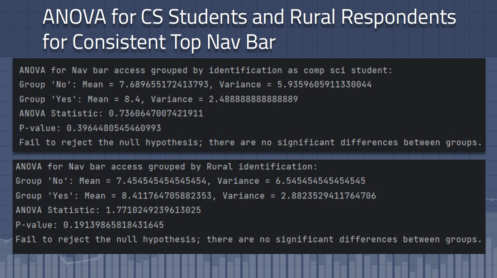

# 🧠 RDN Website UX + Branding Survey Analysis

This repository presents a Python-based data analysis project aimed at uncovering how users perceive and interact with a nonprofit organization's website. The focus is on **user engagement**, **branding effectiveness**, and **UX-driven behavior**, using real survey data and Python visualization libraries.

> 📌 **Why this matters to you as an employer:**  
> This project demonstrates my ability to conduct **user-centered research**, perform **statistical analysis**, and communicate findings visually — all critical skills for roles in **data science**, **UX research**, or **digital strategy**.

---

## 🔍 Project Summary

I designed and analyzed a survey targeting public users of the [Regional Development Network (RDN)](https://example.com). The goal was to understand how people perceive website elements like:

- 🎨 **Color relevance** (esp. Indigenous color symbolism)
- 🎥 **Homepage video impact**
- 📱 **Social media trust signals**
- 🌐 **Clarity of mission and values**

The analysis identifies patterns in responses based on demographic info (e.g., rural vs. urban), prior nonprofit exposure, and overall user engagement.

---

## 🛠️ Tools & Skills Demonstrated

| Skill Area               | Tools / Techniques                       |
|--------------------------|------------------------------------------|
| Data wrangling           | `pandas`, CSV handling                   |
| Data visualization       | `matplotlib`, `seaborn`                  |
| UX/Design research       | Survey design, Likert-scale analysis     |
| Insights communication   | Boxplots, bar charts, heatmaps           |
| Conditional subsetting   | Filtering by rural background, etc.      |

---

## 📊 Visual Outputs

### Engagement vs. Mission Understanding
This boxplot compares user engagement across those who **understood** vs. **did not understand** the organization’s purpose.


---

### Social Media Validation + Branding Signals
Bar charts show how users perceived the trustworthiness of social media presence, homepage video value, and cultural color representation.



---

## 📁 Files Included

- `survey_analysis.py` — Main script: loads, cleans, and visualizes survey data
- `SurveyResponses.csv` (not included in repo) — Raw data source
- `images/Survey.jpg`, `images/Survey2.jpg` — Visual assets generated from analysis
- `README.md` — This documentation

---

## ⚙️ How to Run

1. **Clone this repository**  
```bash
git clone https://github.com/your-username/rdn-survey-analysis.git
cd rdn-survey-analysis
